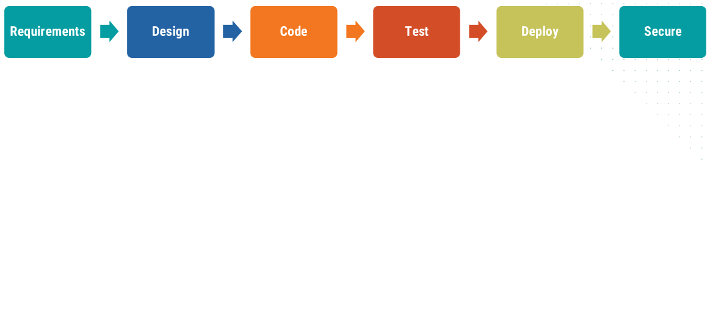
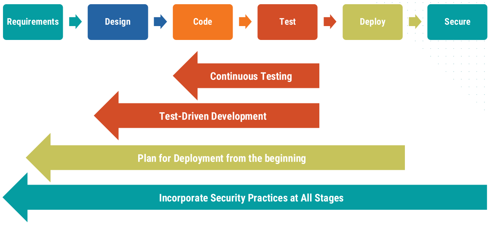
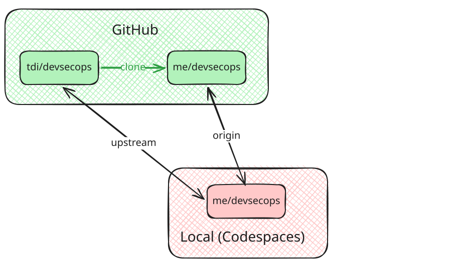
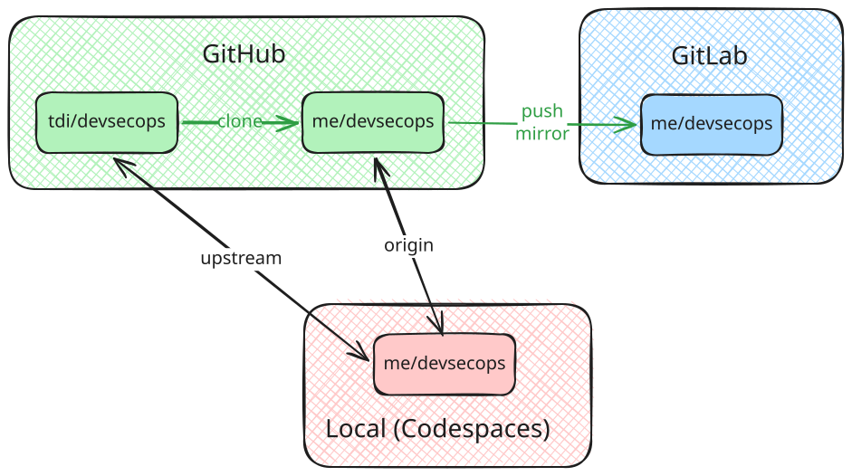
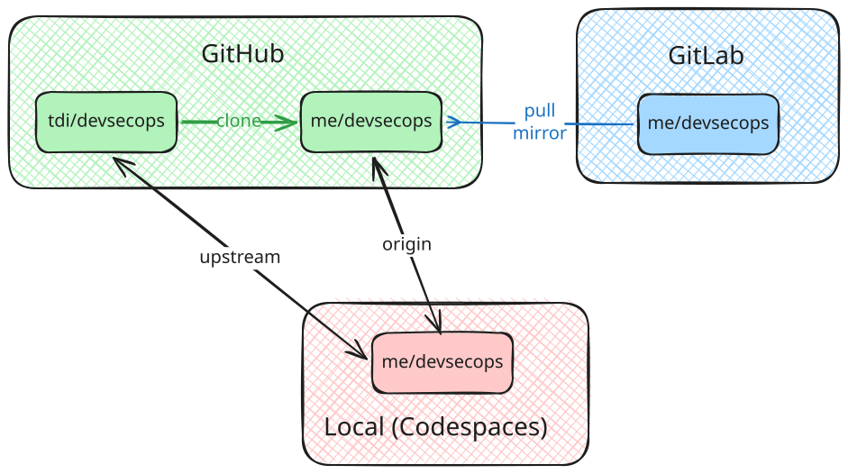
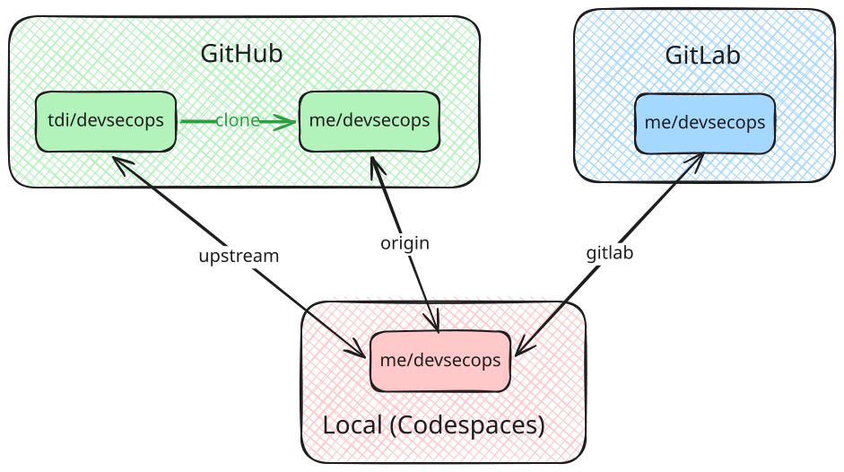

<style>
  :root {
    /* Slide background, code foreground
       Second color is used for class: invert */
    --color-background: light-dark(#f9f9f9, #0288d1);
  }
  .highlighted-line {
    display: block;
    background-color: #ffaa0040;
    margin: 0 -6px;
    padding: 0 6px;
  }
  div.columns {
    display: flex;
    gap: 1em;
  }
  div.columns > div {
    flex: 1;
  }
</style>

# Continuous Integration Testing
<!-- _class: lead -->

Orchestrating Containers

---

## Our Project

1. Managed with git
2. Running Docker containers
3. Orchestrated with Kubernetes
4. **Tested in Gitlab**
5. Deployed with ArgoCD
6. Monitored with Prometheus and Grafana

---

## DevSecOps: _Shift Left_



<!--
Recall discussion of DevSecOps: Old plan, execute, reflect
doesn't work in modern high-tempo environment.
-->

---

## DevSecOps: _Shift Left_



<!--
So, we need to _shift left_ pre-release activities to occur throughout development.

Today, we're looking at testing.
- We want to do it throughout coding phase (at least).
- We need a quick feedback for developers.
=> Need automated testing
-->

---

## CI/CD Systems

We need testing a release preparation to happen _continuously_

- **Continuous Integration (CI):** Developer changes are continuously integrated merged into _main_ branch
- **Continuous Delivery (CD):** The _main_ branch is always in a state ready to be deployed
- **Continuous Deployment (CD):** The _main_ branch is automatically deployed when changes land

---

## Testing and CI/CD

Automated testing is needed to make CI/CD possible

- **Integration:** Only want to integrate working code
  - Tests must pass on feature branch before merging into main
- **Delivery:** Need confidence that main is ready to deploy
  - Tests passing on _main_ help provide this
- **Deployment:** Only want to deploy working code
  - Trigger deployment only once tests pass

---

## Build Automation Tools

_aka_ CI Servers, CI/CD Pipelines, Automation Servers

- Automatically build, test, and (sometimes) deploy code when changes pushed to git repo
- This process generally configured by a file within the repository

---

## Build Automation Hosting

- **Self-hosted:** Run on your own hardware (_Jenkins_)
  - Flexible, but can be costly
- **Managed:** SaaS, hosted in the cloud (_Travic CI_, _CircleCI_)
  - Compute scales as you need it
- **Git-host-integrated:** Integrated directly with your git repo (_GitHub Actions_, _GitLab CI/CD_)
  - Pay for usage beyond a quota

<!--
We used Jenkins for many years, but paid $600/month for a beefy machine
(We want to build multiple jobs simultaneously)
Now, we're on GitHub Actions: Generally < $40/month
-->

---

## CI/CD in the Age of AI Development

- AI agents can write a lot of code very quickly
- Tests may be best (or only) way for humans to judge the code
- Build pipeline may become chokepoint for development
  - Self-hosted tools may end up with increasing queues
  - Recent GitHub Actions instability _might_ be related to exploding AI development
- The eventual solution is unclear at present
  - Expect changes in the coming years

---

## What to Run in Build Automation

- **Build** the project
- **Test** the code
- **Static analysis** of code
- **Deploy** the project

<!--
We'll look at the first three today; deployment we'll bring up next time
-->

---

## Building the Project
- Compile code
- Build environment
- Build docker images

---

## Testing the code
- Unit tests check that individual components work
  - Many fast tests
  - Other components _mocked_ out
- Integration tests check that two components work together
  - Fewer tests; take longer
- End-to-end tests verify the entire system works
  - Simulate user behavior
- External tests check connections with external components
  - Often run on timer as well as on new code

---

## Static Analysis

**Static analysis** reviews code without running it

- **Formatters** address code style (and may fix it automatically)
- **Linters** call out errors or antipatterns in code
- **Type Checkers** check that types are consistent across functions
- **Vulnerability Scanners** search for known security issues

<!--
Linters can get
- Syntax errors
- Logical errors (unreachable code)
- Antipatterns (legal but confusing syntax)
- Security flaws
-->

---

## Flaky Tests

- "Flaky" tests fail apparently randomly
  - Randomness in environment or execution
  - External component may be down
- Should be avoided as much as possible
  - A persistent flaky test conditions you to ignore test failures
- If it can't be fixed, consider allowing retries

---

## Our Setup: GitHub for Code, GitLab for CI/CD

<center>


</center>

<!--
This is what we have set up now
-->

---

## Our Setup: GitHub for Code, GitLab for CI/CD

<center>


</center>

<!--
We want to add a repository on GitLab.  The question is, how do we sync it with
our other copies of these repositories.
-->

---

## Option 1: Push from GitHub to GitLab

<center>


</center>

<!--
This is probably the right way to do that.  But it requires GitHub Actions,
GitHub's build automation tool.  So we'd have to cover GitHub's automation
tool to learn GitLab's automation tool..  So maybe not.
-->

---

## Option 2: Pull to GitLab from GitHub

<center>


</center>

<!--
GitLab supports pull mirroring, where it reaches out to another repo occasionally
to gather changes.  Two downsides:
- Requires a paid plan, so you probably don't have that.
- Runs every 30 minutes, or when manually requested.  Not good for demonstrating
  automation.
-->

---

## Option 3: Fun with Remotes

<center>


</center>

<!--
We'll just add another remote to our "local" environment, pointing to GitLab.
It's up to us to keep the two remotes in sync.

This won't work with a multi-person team.  But for our little test project, it
should be okay
-->

---

## Authentication with git

There are two main ways to authenticate with a remote git repo:

- **HTTPS:** Name and password sent over HTTPS connection
  - Codespaces does magic to make this work with GitHub
  - GitLab requires _personal access token (PAT)_ instead of password
- **SSH:** Authenticate over SSH with public/private key pair
  - Requires creating a key pair
  - Private key stays on local machine
  - Public key can be shared freely

<!--
SSH is a bit complicated, but given that we need to create a new token anyway,
it's probably worth it.
-->

---

## Creating an SSH Key Pair

1. On your Codespace, run `ssh-keygen` in a terminal
2. Press _Enter_ at prompts to accept defaults
3. This should create two files:
    - `/home/vscode/.ssh/id_rsa`: Private key&mdash;keep secret
    - `/home/vscode/.ssh/id_rsa.pub`: Public key
4. Print the public key with `cat ~/.ssh/id_rsa.pub`.  Copy the value.

<!--
Some people have "their" keypair.
I use one keypair per device.  If I lose control of that device, I can delete that
public key from various services, but maintain access from all other devices.
-->

---

## Add Public Key to GitLab

1. Log into GitLab
2. Click user icon in upper right; select _Preferences_
3. From left menu, choose _Access_ ❭ _SSH keys_
4. Click _Add new key_
5. Paste public key into _Key_ field
6. Click _Add key_

---

## Create a new Project on GitLab

A **Project** on GitLab holds a git repository and associated data

1. Navigate to the GitLab homepage
2. Select _Projects_ from the left menu
3. Click _New Project_ in the top right
4. Select _Create blank project_
5. Give it a name and select either your user or group in _Project URL_
6. Deselect _Initialize repository with a README_
7. Click _Create project_

---

## Set GitLab as a Remote in Codespaces

1. On the GitLab project page, ensure that _SSH_ is selected
2. Copy the git address from the first `git clone` line
    - It should look like `git@gitlab.com:username/project.git`
3. In a Codespaces terminal, run
    ```bash
    git remote add gitlab git@gitlab.com:username/project.git
    #                     ^- Replace with the git address found above
    git push gitlab --all
    ```
4. Refresh the GitLab project page.  You should see the project files

---

## Activity: Push a Branch to GitLab
<!-- _class: invert -->

1. Create a branch named _ci_ on your Codespace
2. Edit the README to point out that testing is done on GitLab
3. Commit the changes
4. Push the branch to GitLab with `git push gitlab`
5. Select the _ci_ branch on GitLab and check for the changes

---

## Unit Tests

- Some unit tests are available in `project/images/web-service/tests/test_unit.py`

- These test specific functionality for specific situations

- The `patch` function _mocks_ out other components
  - We want to know that they are called, but don't want to actually test them

- These tests are just a sample; a real project would have more

---

## GitLab CI/CD Pipelines

- Defined in a _YAML_ file
  - By default named `.gitlab-ci.yml` in project root
- Create that file with these contents:
```yaml
unit-test:
  image: ghcr.io/astral-sh/uv:python3.14-alpine
  script:
    - cd project/images/web-service/
    - echo "Installing dependencies and running tests..."
    - uv sync
    - uv run pytest -v tests/test_unit.py
```

---

## Pipeline Contains One or More Jobs

```yaml {1}
unit-test:
  image: ghcr.io/astral-sh/uv:python3.14-alpine
  script:
    - cd project/images/web-service/
    - echo "Installing dependencies and running tests..."
    - uv sync
    - uv run pytest -v tests/test_unit.py
```

Jobs are defined in a top level map

Their names are arbitrary

---

## Jobs Run in Docker Images

```yaml {2}
unit-test:
  image: ghcr.io/astral-sh/uv:python3.14-alpine
  script:
    - cd project/images/web-service/
    - echo "Installing dependencies and running tests..."
    - uv sync
    - uv run pytest -v tests/test_unit.py
```

Each job runs in its own VM

We can specify that it should run in a Docker container of our choice
&rarr; We'll choose the same Docker image we use in our web service

---

## Jobs Execute Scripts

```yaml {3-7}
unit-test:
  image: ghcr.io/astral-sh/uv:python3.14-alpine
  script:
    - cd project/images/web-service/
    - echo "Installing dependencies and running tests..."
    - uv sync
    - uv run pytest -v tests/test_unit.py
```

Our repository gets mounted inside of the container

We can run multiple commands by specifying a list

---

## Push to GitLab

1. Add the file to git tracking: `git add .gitlab-ci.yml`
2. Commit the changes: `git commit`
3. Push the changes to GitLab: `git push gitlab`

On the _Pipelines_ page, you should see a new entry

After a minute it should pass

Click on the pipeline to show the jobs; click on a job to show its logs

---

## Variables

Global variables can be defined under the top-level `variables` key
```yaml
variables:
  UV_IMAGE: "ghcr.io/astral-sh/uv:python3.14-alpine"
  UV_LINK_MODE: copy

unit-test:
  image: $UV_IMAGE
  script:
    - cd project/images/web-service/
    - echo "Installing dependencies and running tests..."
    - uv sync
    - uv run pytest -v tests/test_unit.py
```

---

## Variables Used in Job Definition

```yaml {2,6}
variables:
  UV_IMAGE: "ghcr.io/astral-sh/uv:python3.14-alpine"
  UV_LINK_MODE: copy

unit-test:
  image: $UV_IMAGE
  script:
    - cd project/images/web-service/
    - echo "Installing dependencies and running tests..."
    - uv sync
    - uv run pytest -v tests/test_unit.py
```

Define the image we're using in one place
&rarr; Can reference in multiple jobs

---

## Variables Passed into Test Environment

```yaml {3}
variables:
  UV_IMAGE: "ghcr.io/astral-sh/uv:python3.14-alpine"
  UV_LINK_MODE: copy

unit-test:
  image: $UV_IMAGE
  script:
    - cd project/images/web-service/
    - echo "Installing dependencies and running tests..."
    - uv sync
    - uv run pytest -v tests/test_unit.py
```

Changes how _uv_ does caching, to avoid some warnings

---

## Push Changes to GitLab

Save file, commit changes, and push to GitLab

Another pipeline should start, running the updated job

Check that it passes

---

## Activity: Failing Tests

<!-- _class: invert -->

Tests are only meaningful if they can fail
$\Rightarrow$ A common development step is to make a test fail
<small>Usually this is done on local development machine, not CI</small>

1. Alter a test in `project/images/web-service/tests/unit_test.py`
    - _e.g._ Change _test_parse_count_zero_ to check wrong number
2. Commit the change and push to GitLab
3. Check that the pipeline fails
4. Revert the change, push, and see that it passes again
    - You can use `git revert HEAD`

---

## Adding Linting

Code **linting** is static analysis looking for errors and antipatterns
&rarr; In Python, this can be done with the tool _ruff_

Add a job to `.gitlab-ci.yml`:
```yaml
lint:
  image: $UV_IMAGE
  script:
    - cd project/images/web-service
    - uv sync
    - uv run ruff check src/
```

---

## Running the Linter

Commit the changes and push to GitLab

Another pipeline should start
&rarr; It will run two jobs: _unit-test_ and _lint_

&hellip; and _lint_ should fail!

- Line 101: Catching "blind exception"
- Line 135: Invalid type

---

## Activity: Fixing Lint Errors

<!-- _class: invert -->

In `project/images/web-service/src/web_service/__init__.py`:
- Line 101: Append `# noqa: BLE001`
  - Tells _ruff_ to ignore that issue
- Line 135: Put quotes around `8000`
  - Change value from integer to string

Commit, push to GitLab, and check that it's now passing

---

## Testing the K8s Manifests

The [Kubeconform](https://github.com/yannh/kubeconform) tool validates Kubernetes configuration files

Add another job to `.gitlab-ci.yml`:
```yaml
validate-k8s-manifests:
  script:
    - |
      curl -Lo kubeconform.tar.gz \
      https://github.com/yannh/kubeconform/releases/latest/download/kubeconform-linux-amd64.tar.gz
    - tar xzf kubeconform.tar.gz kubeconform
    - ./kubeconform -summary project/services
```

---

## Testing the K8s Manifests

```yaml
validate-k8s-manifests:
  script:
    - |
      curl -Lo kubeconform.tar.gz \
      https://github.com/yannh/kubeconform/releases/latest/download/kubeconform-linux-amd64.tar.gz
    - tar xzf kubeconform.tar.gz kubeconform
    - ./kubeconform -summary project/services
```
- No image specified, so GitLab uses a default Docker image
  - Happens to be _ruby3:1_
- First line of script using a syntax for a multi-line string
  - Just to try to make it readable here

---

## Testing the K8s Manifests

```yaml
validate-k8s-manifests:
  script:
    - |
      curl -Lo kubeconform.tar.gz \
      https://github.com/yannh/kubeconform/releases/latest/download/kubeconform-linux-amd64.tar.gz
    - tar xzf kubeconform.tar.gz kubeconform
    - ./kubeconform -summary project/services
```
Commit, push, and check for passing tests

<small> You know the drill by now</small>

---

## Integration Test

**Integration tests** check that different components can work together

Typically more complicated to set up; take longer to run
$\Rightarrow$ Fewer tests than unit tests

In `project/images/web-service/tests/test_integration.py` are tests that check our service can talk to the Ollama service

This needs a running copy of the Ollama container

---

## Integration Test (pt. 1)

```yaml
integration-test:
  image: $UV_IMAGE

  services:
    - name: ollama/ollama:latest
      alias: ollama

  variables:
    OLLAMA_URL: "http://ollama:11434"
    OLLAMA_MODEL: "qwen3:0.6b"
    VISIT_COUNTER_FILE: "/tmp/visits.txt"
```
_&mdash;Continues&rarr;_

---

## Services are Additional Containers

```yaml {4-6}
integration-test:
  image: $UV_IMAGE

  services:
    - name: ollama/ollama:latest
      alias: ollama

  variables:
    OLLAMA_URL: "http://ollama:11434"
    OLLAMA_MODEL: "qwen3:0.6b"
    VISIT_COUNTER_FILE: "/tmp/visits.txt"
```
_&mdash;Continues&rarr;_

---

## Variables Defined for One Job

```yaml {8-11}
integration-test:
  image: $UV_IMAGE

  services:
    - name: ollama/ollama:latest
      alias: ollama

  variables:
    OLLAMA_URL: "http://ollama:11434"
    OLLAMA_MODEL: "qwen3:0.6b"
    VISIT_COUNTER_FILE: "/tmp/visits.txt"
```
_&mdash;Continues&rarr;_

---

## Integration Test (pt. 2)

_&larr;Continued&mdash;_
```yaml
  before_script:
    # See reference/ci/integration.yml for full implementation
  script:
    - cd project/images/web-service
    - uv sync
    - uv run pytest -v tests/test_integration.py
```

---

## GitLab `before_script`

_&larr;Continued&mdash;_
```yaml {1-2}
  before_script:
    # See reference/ci/integration.yml for full implementation
  script:
    - cd project/images/web-service
    - uv sync
    - uv run pytest -v tests/test_integration.py
```

The `before_script` and `script` get concatenated and run as one
&rarr; Any failure in either causes job to fail
&rarr; Can share `before_script` among multiple jobs

<!--
Here, only purpose of `before_script` is to help organize pieces
-->

---

## Integration Test

Full _integration-test_ job definition available in `reference/ci/integration.yml`

1. Copy job into `.gitlab-ci.yml`
2. Save, commit, and push to GitLab
3. Check that all tests pass

---

## Stages Order Execution

Our next step will be to build the _web-service_ Docker image
$\Rightarrow$ But we only want to build it if tests are passing

By default, jobs run in parallel

Jobs are grouped in **stages** that run sequentially

We have not specified stages so far
$\Rightarrow$ All jobs grouped into default _test_ stage

---

## Adding Explicit Stages

Add beginning of `.gitlab-ci.yml`, add list of stages:
```yaml
stages:
  - test
  - build
```

This sets the order in which stages execute

---

## Assign Jobs to Stages

In each job, add `stage` key:
```yaml {2}
job-name:
  stage: test
```

All existing jobs can be added to the _test_ stage

---

## Build Job

```yaml
build-image:
  stage: build
  image: docker:27-cli
  services:
    - docker:27-dind
  variables:
    DOCKER_TLS_CERTDIR: "/certs"
  script:
    - docker build project/images/web-service -t web-service
    - docker save -o web-service.tar web-service:latest
  artifacts:
    name: "docker-image-$CI_COMMIT_SHORT_SHA"
    paths:
      - web-service.tar
    expire_in: 1 day
```

---

## Use Docker-in-Docker to Build Image

```yaml {3-5}
build-image:
  stage: build
  image: docker:27-cli
  services:
    - docker:27-dind
  variables:
    DOCKER_TLS_CERTDIR: "/certs"
  script:
    - docker build project/images/web-service -t web-service
    - docker save -o web-service.tar web-service:latest
  artifacts:
    name: "docker-image-$CI_COMMIT_SHORT_SHA"
    paths:
      - web-service.tar
    expire_in: 1 day
```

---

## Save the Image to a Tar File

```yaml {10}
build-image:
  stage: build
  image: docker:27-cli
  services:
    - docker:27-dind
  variables:
    DOCKER_TLS_CERTDIR: "/certs"
  script:
    - docker build project/images/web-service -t web-service
    - docker save -o web-service.tar web-service:latest
  artifacts:
    name: "docker-image-$CI_COMMIT_SHORT_SHA"
    paths:
      - web-service.tar
    expire_in: 1 day
```

---

## Make File Available as an _Artifact_

```yaml {11-15}
build-image:
  stage: build
  image: docker:27-cli
  services:
    - docker:27-dind
  variables:
    DOCKER_TLS_CERTDIR: "/certs"
  script:
    - docker build project/images/web-service -t web-service
    - docker save -o web-service.tar web-service:latest
  artifacts:
    name: "docker-image-$CI_COMMIT_SHORT_SHA"
    paths:
      - web-service.tar
    expire_in: 1 day
```

---

## Build Stage

Save, commit, and push to GitLab

Pipeline should show two stages

_build_ stage runs only when all _test_ stage jobs pass

Image tarball available on _Artifacts_ page

---

## The Missing End-to-End Test

There should be an additional **end-to-end** test that checks our Kubernetes pods actually come up and talk to each other

We tried, and failed, to get _Minikube_ working in GitLab CI/CD

The "right" solution is to use [Kubernetes integration tests](https://docs.gitlab.com/runner/development/internal/ci/kubernetes_integration_tests/)
- GitLab CI/CD can create pods on a K8s cluster you provide
- Analyze if pods come up and an operate correctly

---

## Make a Merge Request

On GitLab, make a **Merge Request** to merge the _ci_ branch into _main_
&rarr; This is GitLab's version of GitHub's "Pull Requests"

After the merge request is opened, the status of tests on the last commit on the branch will be displayed

Can enforce that tests must pass before merges with _Pipelines must succeed_ setting
&rarr; Found under _Settings_ ❭ _Merge requests_

---

## Feedback

<!-- _class: lead invert -->


[form.typeform.com/to/rBuWRmz4](https://form.typeform.com/to/rBuWRmz4)

<!--
Form link: https://form.typeform.com/to/rBuWRmz4
-->
